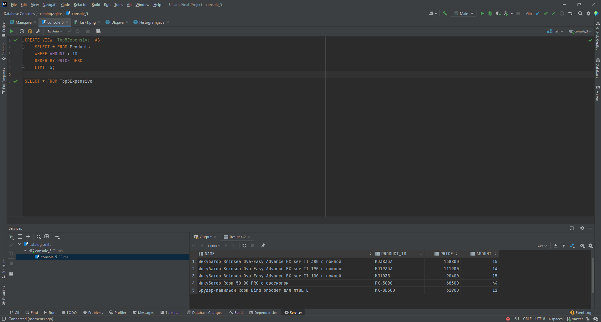

# Последовательность работы по проекту

1. Создание класса Db, который содержит метод для создания подключения к БД.
2. Создание класса Product для удобной работы с catalog.csv.
3. Создание класса CsvTools для парсинга .csv файлов.
4. Обновление класса Db: создание метода для обновления БД данными, полученными из парсера.
5. Создание класса Histogram для удобного создания и сохранения гистограмм.
6. Создание Main.java, объединяющего все вышеописанные классы.

---

# Задание 1. Гистограмма средних цен товаров.

---

## Задание 2. Средняя стоимость инфракрасной лампы.

---

## Задание 3. Выборка 5 самых дорогих товаров с остатком на складе больше 10.

